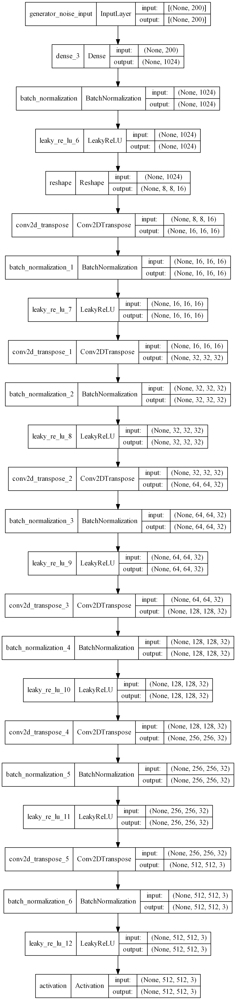
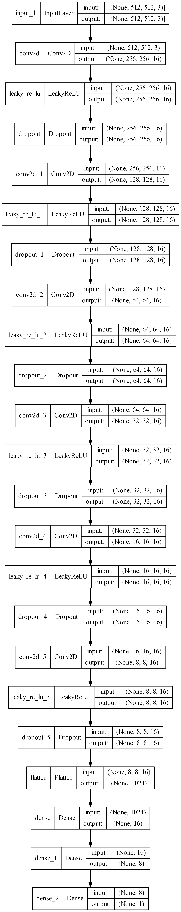

# **ABSTRACT ART GENERATOR**

<hr>
This project is developed to demonstrate **DCGAN** network architecture which generates abstract art images.
<hr>

## Table of Contents

### 1. [Introduction](#Introduction)

### 2. [Architecture](#Architecture)

### 3. [Training & Evaluation](#Training&Evaluation)

### 4. [Referecnces](#Referecnces)

## Introduction

Thsi project has implemented **DCGAN** network architecture which contains **Generator** and **Discriminator** model to generate sample of size (512 _ 512 _ 3) based on given training data.

<hr/>

## Architecture

It is composed of Generator and Discriminator model, To understand further..

The Generator model implements transpose convoluational layer to perform convoluation as well as upsample the output of convoluation using strides of (2,2) whicle keeping the padding same and applying leakyRelu activation to each genrated output. Graphical representation is as follows:


<hr>
The Discriminator model implements convoluation layer to perform convoluation and apply maxpooling of (2,2) to downsample images and afterwards uses fullyconnected layer to output prediction by applying sigmoid activation. Graphical representation is as follows:


<hr>

## Training & Evaluation

Following parameter were used while training the network

```
 Image height : 512

 Image width : 512

 Image Channel : 3

 batch size : 16

 latent dim : 200

 number of epochs : 200
```

network seems to generate close to real images out of provided latent dimension which can be seen during the training.


some of the sample that were generated by network during testing,


further model can be trained for more epoches to get better result from the network.

## References

dataset link

> https://www.kaggle.com/datasets/greg115/abstract-art

other useful links

> https://github.com/bnsreenu/python_for_microscopists/blob/master/248_keras_implementation_of_GAN/248-cifar_GAN.py

> https://github.com/nikhilroxtomar/DCGAN-on-Anime-Faces/blob/master/gan.py
